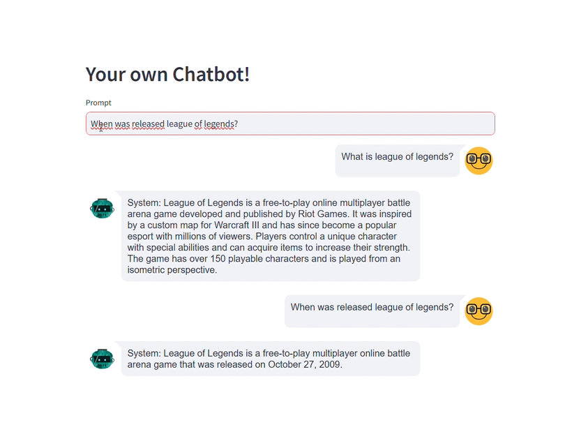

# Openai & LangChain - Create a ChatGPT with your PDF Files

This repository contains a chatbot designed to answer questions about the content of PDF documents. It leverages the power of LangChain to extract information from PDFs, OpenAI's API for natural language processing and generation, and Pinecone as a vector store for efficient semantic search and retrieval of relevant information. A user-friendly frontend has been added using Streamlit for easy interaction with the chatbot.



Key Features:

* 📄 **PDF Ingestion:** Easily upload and process PDF documents.
* 🔗 **LangChain Integration:** Streamlines the extraction and manipulation of text from PDFs.
* 🤖 **OpenAI-Powered:** Utilizes OpenAI's advanced language models for understanding questions and generating accurate, informative responses.
* 🗂️ **Pinecone Vectorstore:** Enables fast and relevant retrieval of information from the PDF documents based on semantic similarity.
* 🌐 **Streamlit Frontend:** Provides an intuitive web interface for users to interact with the chatbot

## Setup 💻
Before running, you need to set a few environment variables and commands:

1. Clone the repo or download the ZIP
```
https://github.com/PrMestizo/PDF-Chatbot.git
```
2. Install pipenv if it's not already installed
```
pip install pipenv
```
3. Install the project's dependencies
```
pipenv install
```
4. Activate the virtual environment:
```
pipenv shell
```
5. Set up your .env file
```
OPENAI_API_KEY=<your-openai-api-key>
PINECONE_API_KEY=<your-pinecone-api-key>
PINECONE_INDEX=<your-pineconde-index>
```
How to get your OpenAI API Key https://platform.openai.com/account/api-keys

How to get your Pinecone API Key https://docs.pinecone.io/guides/get-started/quickstart

## Instructions 📃

### Script 1: ingestion.py
This script processes PDF documents, splits them into chunks, generates embeddings, and stores these embeddings in a Pinecone vector store.
 
1. Place your PDF files in a directory named Data.
2. Ensure you have a .env file with your Pinecone API key and index name.
3. Run the script to store embeddings.

### Script 2: main.py
This script loads stored embeddings from Pinecone and uses them to answer questions.

1. Ensure the .env file contains your Pinecone API key and index name.
2. Run the script and pass your question to get an answer.

### Script 3: app.py
This script creates a web interface using Streamlit to interact with the chatbot, which answers questions based on the stored embeddings.

1. Ensure the .env file contains your Pinecone API key and index name.
2. Run the script to start a web interface with the next command:
```
streamlit run <your-route/app.py>
```
3. Enter your questions in the text field to receive responses from the chatbot.
